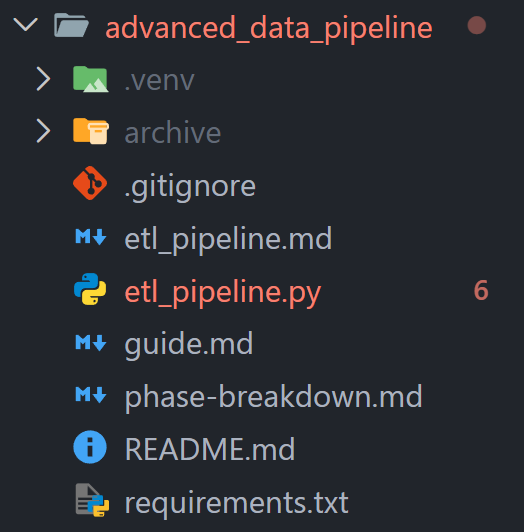

# ETL Documentation and Notes

## Getting started

### 1. Project setup 
**Look at the `guide.md` file for more details**
 1. Create the same folder structure you see here
 2. Create a virtual environment (.venv)
 3. Install all dependencies with a single command using (requirement.txt); 
    run `pip install -r requirements.txt` or just install them how we usually do it in class. (see `guide.md`)
 4. Add the data to the project (archive)

### 2. Start hacking!
1. Start working with the `etl_pipeline.py` file.
    You will primarily work with the `orders`, `order_items`, `products`, and `customers` datasets.
2. Use the `guide.md` Phase 2 for help!